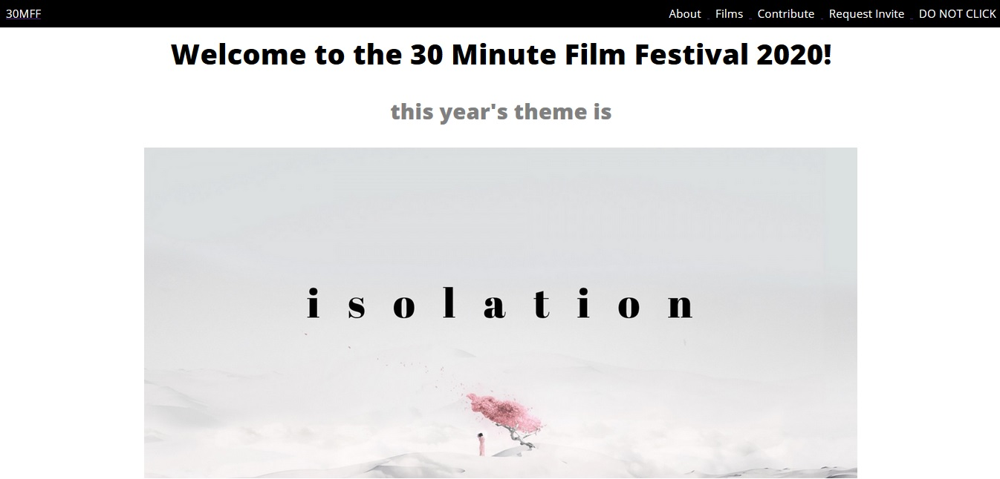

# ASSIGNMENT #1: [30MFF WEB SITE](https://mlk525.github.io/)

  
Screenshot

    

## Description
A website to debut this year's 30MFF films. Designed to function as the landing page for a fictional film festival, the website pokes fun at its subject's non-existent nature quite a bit. Beyond serving as a sandbox for me to play around with the concepts we learned about in HTML, CSS and JavaScript, the website was created to give the unsuspecting user an initial impression of legitimate film festival-ness, which would crumble (hopefully in a humorous fashion) upon closer observation. With that in mind, I strived for a sort of minimialist look, going from classy and established to steadily more ridiculous content.

## Process
Writing for the website was easy; as someone who spends a large part of their time on Reddit, I didn't have to look far for inspiration. All the text on the website either has hidden jokes, or is directly lifted from popular [copypastas](https://en.wikipedia.org/wiki/Copypasta). The images are from popular stock websites, except for those advertising the films in the fictional film festival itself; these screencaps were taken from what I considered to be iconic moments in each group's film.

Working with CSS and HTML on this project was easier than I anticipated, due to the abundant resources provided by the professor of our class as well as the internet. Some of the sites that I have interacted with smoothly scroll to different sections of the site when the shortcuts are clicked from the floating menu. At first I thought that this would be challenging to implement, but after speaking with the professor and looking up different methods to allow for smooth scrolling within a webpage, I implemented the idea using a stickied top menu element, and simply enabling smooth scrolling in the html tag within the CSS file.

The formatting of the website was quite easy to achieve; using a combination of 
, <section>, and   tags I was able to leave adequate spacing between elements. The pictures were all centered on the webpage by enclosing them within a paragraph tag, with the alignment attribute set to "center". I employed JavaScript to incorporate an image gallery that 

Two easter eggs within the website that I'd like to draw attention to are the 'DO NOT CLICK' option in the menu bar, and the section that isnt linked anywhere else in the page, right at the bottom. The DO NOT CLICK button is a link to Rick Astley's Never Gonna Give You Up, in a juvenile attempt at a [rickroll](https://en.wikipedia.org/wiki/Rickrolling). If it makes even one user laugh, it's existence on the webpage is justified. The second easter egg is my group's full movie, embedded at the bottom of the webpage. This was quite simple to implement (using a <video> tag), but it's purpose is to reward users that think to scroll beyond what the menu options offer them. It serves as a "sneak-peek" to the film festival. 

## Reflection/Evaluation
Looking back, I think it's safe to say that most of my expectations were met during the course of this project; the exception being my goal to make my website fully responsive, and usable on every platform (specifically across desktop *and* mobile). The JavaScript element
From what I could gather after speaking to my friends who interacted with the website, my intention to entertain the user if they took a closer look at the website was achieved. 

This should bookend the initial concept and talk about whether your expectations and goals were met in the process of building the final working version.

