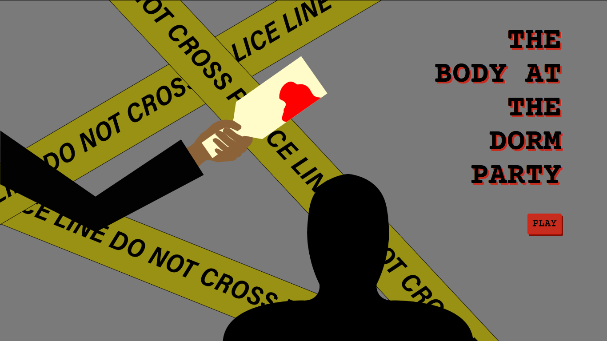
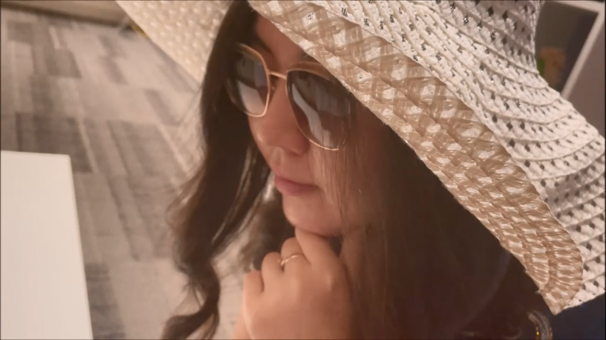
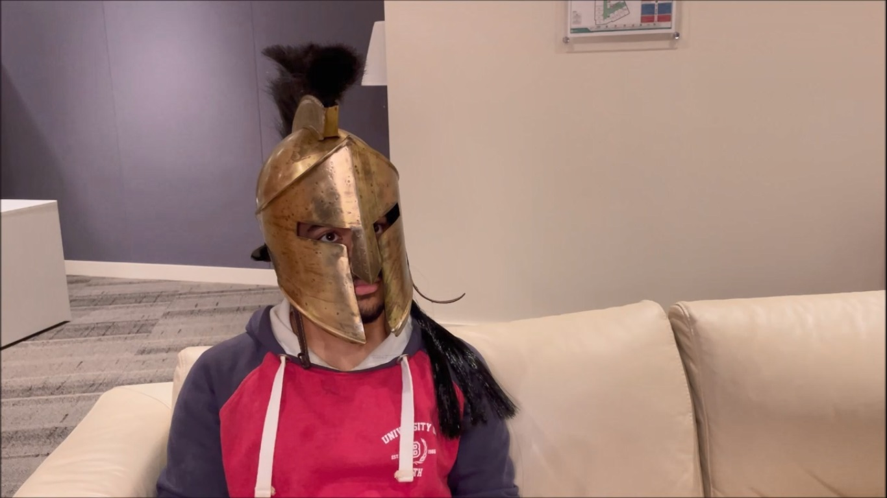
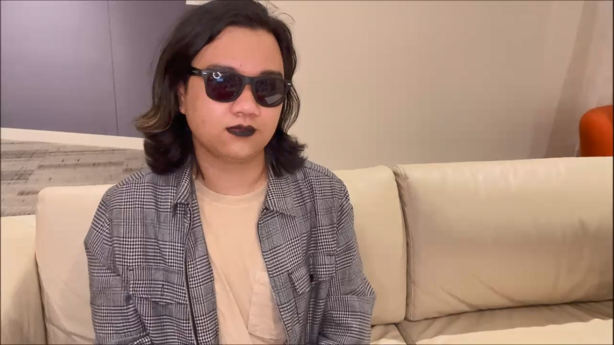
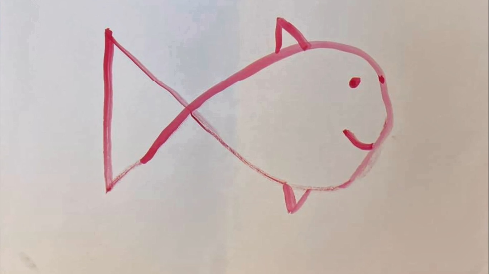

# ASSIGNMENT #4: [THE BODY AT THE DORM PARTY](https://mlk525.github.io/body-at-the-dorm-party/)
## (Interactive Video Piece)

# Description
'The Body at the Dorm Party' (BDP) is an interactive video project, centered around a murder (gasp!) at, you guessed it, a dorm party. By reviewing videos of evidence collection and suspect interrogation, the user helps Detective Amina ('Detective' is her first name, not an indicator of status in law enforcement) solve the murder of Residential Assistant Aiyma Boddy.

Intended to parody some of the more dramatic tropes in mystery, thriller, and "[whodunit](https://en.wikipedia.org/wiki/Whodunit)" genres, BDP makes use of exaggerated mannerisms, overly melodramatic themes and sound effects, and gaudy visuals to realize this goal. After examining evidence and suspect interviews, the user is expected to make a guess as to who the murderer is, as well as arranging the order of events associated with the pieces of evidence.

  

Solving the mystery correctly will play a final video concluding the arc. While solving the mystery is very rewarding, our intention for the site was to entertain simply by using it. The project was conceived with humor as a priority, making the user laugh a little (or a lot), and I feel the videos and overarching site experience reflects that. 

# Process
[Link to repository with video files and code.](https://github.com/mlk525/mlk525.github.io/tree/master/body-at-the-dorm-party)

For this project, my main role was creative direction, including script writing, coordinating filming, and editing the final videos. After we settled on the idea and fleshed it out, I got to work on a script (you can find a later draft [here](https://docs.google.com/document/d/1Y77dlHRMxfMHkk2yU6FXiQywgz63FphFgXG5HPrdUls/edit?usp=sharing)). To communicate the themes appropriately, I drew from my experiences with famous murder mystery media, ranging from Agatha Christie to Cluedo to TikTok videos. We went into recording the shots fairly quickly, taking advantage of the long break to finish as much of the "leg work" as we could. I also left the script in a very flexible place, to rework it during filming. I find dialogue works better when it's closer to the real life "voices" of people playing the parts, so revising the script during filming gave me an opportunity to do that.

I'm not much of a cameraman, but with a clear vision of what we imagined the visuals to look like, we were able to settle on angles for me to shoot in each scene fairly quickly. We shot as much footage as we could on the shoot day, to give me plenty of material to work with and to avoid having to work around our schedules to meet up again. The actual process of filming the videos ended up being quite pleasant; we all had similar ideas of what the final videos would look like, and the flexibility of the script meant no one had to memorize all their lines in one go. The main way this was done was by dividing the interviews into "scenes", intercut with color bars (implying the interrogations were being intermittently recorded), rather than recording it in one shot.

  

To edit the videos, I used Windows Movie Maker, which is a fairly outdated software that lack functionality, especially compared to more comprehensive editing programs like Premiere or AfterEffects; it does, however, have the advantage of running on my laptop without a significant lag. Once I realized I could achieve visual effects quite close to what I was hoping for in Movie Maker, I switched to it immediately. I have a lot more experience working with it (almost 11 years now), which allowed me to make and export edited cuts for feedback as soon as my teammates made suggestions. The many bugs in the software, especially when dealing with audio, did make it hard to assemble a soundscape up to the standard I hoped for, but it did a good enough job. The issues with audio were tackled (very well) by Matthew, using a DAWS, and I was able to plug in the new files with far better results.

I used mostly royalty-free stock audio for the background theme and the harsh "suspense" sound effect, in addition to segments of the dramatic classical soundtrack of Knives Out, a murder mystery thriller I had seen recently, which seemed like a perfect fit for a couple scenes.

The only real editing challenge was cutting out large portions of dialogue to stop the videos from becoming unnecessarily lengthy. We had shot enough footage that I was able to intercut different takes (with slightly varied dialogue), in order to communicate all the necessary information, without each video going on for too long. Suggestions from my groupmates, as well as our professor, helped immensely, and the relatively fast process of implementing suggested edits allowed for more refined cuts.

  

Overall, the process felt quite smooth for me; finishing the shooting early and being able to get feedback quickly made it less stressful, and the nature of the videos made editing them pretty entertaining.

# Reflection/Evaluation
I've worked on scripts for short films in the past, but in those projects I was exclusively the scriptwriter; similarly, in projects I've edited for I had no involvement in the actual filming process. In that regard, this was a new experience for me. Having more control over the content being created seemed liberating, but on reflection, it can also be quite frustrating. Not having a say in certain parts of the filmmaking process means resigning yourself to doing the best you can with what you have, but knowing you could have given yourself something better to work with is annoying.

I'm really glad I worked on this project with this particular team, considering how well each joint part of the process went. The website especially serves as an incredible medium for the videos, almost singlehandedly forming the entire experience. I love how the music I found was able to bring out the best in each character's scenes, and I took particular pleasure in using the music from Larry David's 'Curb Your Enthusiasm' for the final scene in the final video.

I learned a lot about the filmmaking process, as I do with every project involving filmmaking, but I appreciate how much more I learned about interactivity and film in the course of working on this assignment. Imagining how the user would perceive and react to each line of dialogue seems like something that matters in every film, but here we needed to look out to ensure a positive user experience that would also enable them to actually solve the mystery themselves. The process of working on this project taught me quite a bit about thinking of the audience, not only in ways applicable to interactive media but to film as well. I look forward to working on projects like this in the future

  

