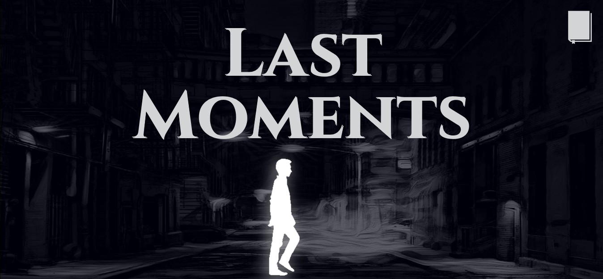
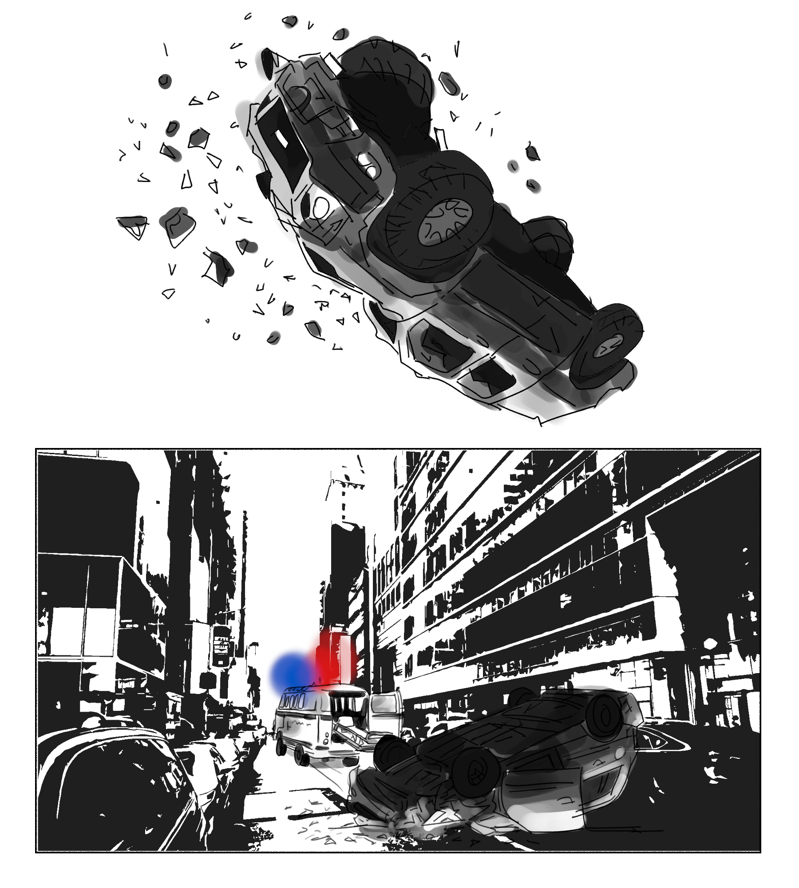
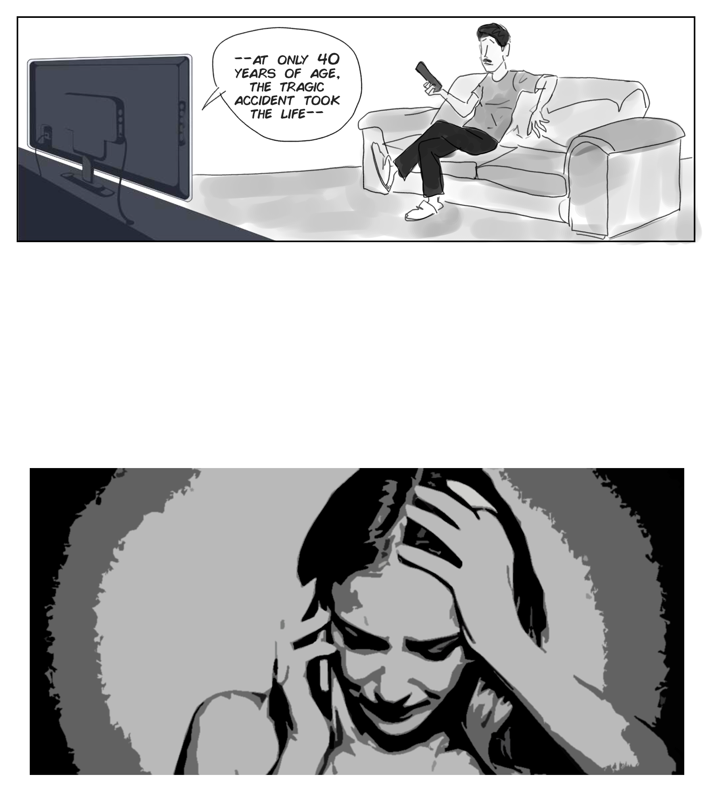

# ASSIGNMENT #2: [LAST MOMENTS INTERACTIVE COMIC](https://mlk525.github.io/last-moments/)

# Description
Initially titled 'A Life in Final Moments,' this interactive audiovisual project was designed to explore the idea that *each of us will inevitably talk to someone for the last time; what would a life look like through these “final moments.”* We wanted to let the viewer experience the life of a main character solely through self-contained interactions, that were, unbeknownst to the parties involved, the final interactions that would ever take place between them.

An additional idea we wanted to explore was the concept of a second-person narrative. Narratives are almost always constructed from the perspective of the “main character”, and through this project, we wanted to see what the opposite would look like.

Ultimately we decided to have the comic follow three characters during the last day of the life of an ambiguous person (named Bob). The goal was to invoke a sense of the impermanence of life, and to draw attention to the experiences of the living during such tragedies.

# Process
[Link to repository with code.](https://github.com/mlk525/mlk525.github.io/tree/master/last-moments)

Tackling such a sensitive theme was challenging, but by focusing on the message we were trying to convey, our group was quickly able to work out a storyboard of what we wanted to convey. Of course, this underwent many changes during the course of the project, but the core idea stayed the same: Bob dies, but this story isn't about Bob.

After initially planning to cover "final moments" over the course of Bob's entire life, we ended up focusing on the last day that he was alive. Limiting the characters to three, not including Bob (it wasn't about Bob), we settled on a childhood friend, his boss, and his wife. More accurately, we settled on Bob being each person's childhood friend, employee, and husband. By keeping a limit on the time frame the comic would occur over, and on the number of characters we look at, we hoped to deliver a more powerful and succinct message.

Deciding on a look for the webpage and the comic was significantly harder; how do we want to come across? Taking inspiration from old gothic noir detective type comics, we kept the theme essentially entirely grayscale, with the exception of a few splashes of color here and there. While most of the panels were hand-drawn, I made an effort to vary the style between each character to represent something of a lack of continuity between them; rather than a lack of story continuity, I wanted to communicate a sense that each page was being told from the perspective of a very different person.

While it was difficult to explore such complex concepts in a relatively limited time, we tried to think of every minute detail that could facilitate better communication of our intended message. Some more of the artistic decisions we took include the lack of any 'on-screen' lines for Bob, not to mention the lack of a face or any real defining traits. In order to further dramatize the story and push the viewer into the deep end as it were, we started off with an out-of-context car crash on the very first page.

The last page isn't any less jarring. Simply a gif of a EKG monitor flatlining, the gif exists to bookend the comic with a heavily suggestive theme that ties back to the first page. A very important addition to the comic was ambient noise and sound effects wherever appropriate for each page. In our opinion, this helped immerse viewers more deeply in what was intended to be a dark and serious piece. Initially not part of our plan, we also came up with the idea of an epilogue for the aforementioned characters as well, briefly looking at how each of them finds out about Bob's passing. You can see this page in progress below:

The icons and imagery used for the website navigation and for displaying the comic itself were very carefully considered. By using a virtual hardbound book, an air of seriousness was conveyed that wouldn't normally be easy for what is essentially a webcomic. Beyond this, website navigation was a fairly straightforward process, as the entire project was contained on a single [page](https://mlk525.github.io/last-moments/).

# Reflection/Evaluation
After helping produce this (hopefully) thought-provoking and poignant work, I am glad to have worked on this fairly morbid piece, rather than on a more generic or cheerful one. Forcing myself to think about how conveying information and interactivity would change with the tone of the piece was very engaging. I do wish we had more time, because as I've mentioned above, a project like this takes more than just enthusiasm to get right. Perfecting a piece like this would have been invaluable to any future viewer experience, and my only real regret is not being able to have "outsiders" take it for a test drive.

I am also now more aware than ever of how difficult it can be to realize exactly what you set out to. Going from scrolling to clicking to turning the pages of a JavaScript book, means you can't insist on sticking to the original wireframe. Having lots of people in a team means you cannot expect everything  when you need it, or for everyone to agree on everything, for that matter. I do feel we achieved what we set out to, albeit in a very different way than what we intended.
