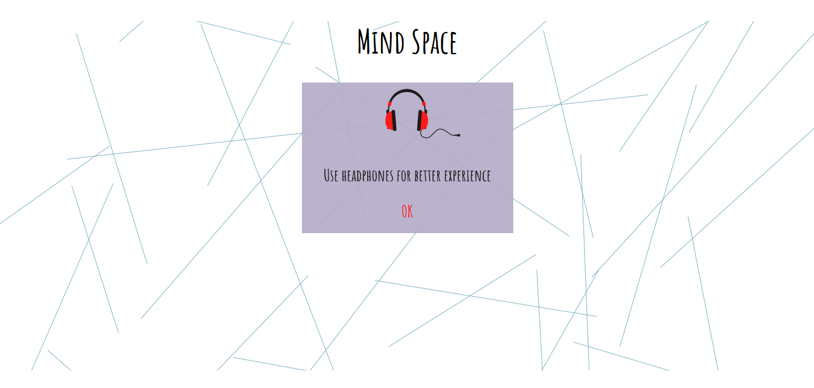
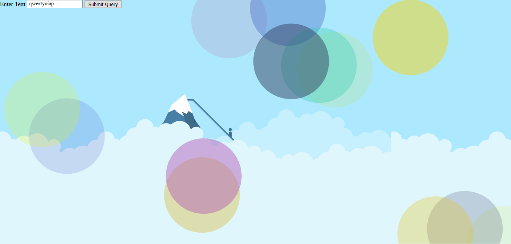

# ASSIGNMENT #3: [MIND SPACE (Web-Based Audio Experience)](https://mlk525.github.io/mind-space/)

# Description
Mind Space is a site-specific auditory experince centered around writing a letter, created to raise awareness for mental health and individual mental health struggles. Divided into three parts, the website first indicates that it is an audio-based by prompting the user to use headphones, before playing the first sound file. Intended to present a calm and positive environment, the user is introduced to the creators of the site (Hessa and I), who are apparently located in a coffee shop. The song [Prelude in C Major](https://www.youtube.com/watch?v=ToWj_4xvVZA), composed by J.S. Bach, is used to set the ambience and tone of the experience. The creators casually talk about Mind Space, its purpose, and how the user can expect to interact with it. They then prompt the user to click on an arrow to the bottom left of the page which will take them to the letter-writing section.

The blank letter allows the user to fill up to 10 lines of text, in addition to their name. While typing, animated circles appear and fade around and behind the letter, while piano notes play on each key press. The user is welcome to write a letter addressed to everybody, someone in particular, or nobody. Brain dumps and rants are welcome; the purpose is to allow the user to acknowledge and address any difficult emotions or experiences, however they wish. The sounds and visualizations are intended to contribute to the feel of the space the user finds themself in, and represent their state of mind to a degree.

Finally, when the 'Send' button is clicked, the letter is folded and pushed into an envelope (an animation intended to convey a sense of closure), and the final sound file plays. The creators (again, Hessa and I) address the user, giving them to choice to write another letter or learn more about mental health through listed resources. 

# Process
[Link to repository with code.](https://github.com/mlk525/mlk525.github.io/tree/master/mind-space)

While building the site, the visuals were largely kept similar to the initial wireframe Hessa designed. The lines in the background especially were an unexpected but welcome elemt to the site. As the user goes through each section of the site, the lines get less and less crowded, representing the mental clarity (hopefully) being achieved by the user. Keeping the color palette to generally muted and subtle tones (emphasizing on blue and violet), the theme of the website is relaxed and positive. The simple aesthetic and thought-out elements made it far easier and more fun to interact with the site while testing it.

In terms of the interactive elements, the arrow to skip from the (somewhat lengthy) intro sound file straight to the letter writing was added as an afterthought when reviewing the functionality of the website. The intro audio can be stopped by both the arrow and the 'Send' button on the letter, ensuring the intro and outro sound files don't overlap. The animation of the letter being inserted into the envelope was part of our initial vision for the site, included to convey (as mentioned previously) a sense of closure for the user. We hoped to be able to include a feature where users could send their letters to others, but the process proved too complicated to implement. We also faced challenges when incorporating the "write a new letter" feature, which Hessa did an excellent job of working through.

While assembling the audio, I worked exclusively with Audacity; this presented a few challenges, but nothing a few plug-ins couldn't fix. Hessa and I recorded the dialogue for both the intro and outro using our phones, but because we were in different locations with different devices, making it seem like we were in the same room for the conversation took a lot of work. Following some very helpful suggestions from Kristin, I cleaned up the audio and used the Parametric EQ and Filter Curve functions to make the audio files sound similar. I also made use of the Panning function and "moved" each speaker to either side. I completed the pieces by adding ambient noise recorded at a coffee shop, recordings of a chair being pulled out and sat on, and myself stirring a cup and sipping "coffee". I also downloaded an audio file of footsteps walking, and once again using Panning, I managed to make it sound like someone entered from the right and walked over to the left. Normalizing the audio and using the Filter Curve option really allowed me to nail the soundscape. Finally, to add background music I combined an online recording of [Prelude in C Major](https://www.youtube.com/watch?v=frxT2qB1POQ), with simple accompaniment over the opening notes played by me on violin (over a slower version of the piece). I recorded the violin by duct-taping my phone to a desk lamp and positioning it over the f-holes of the instrument. The outro was completed very similarly, as there were no real differences aside from the dialogue.

The musical keyboard was a part of the concept from the start, so I had begun experimenting with it from day one. The [github repo](https://github.com/VasuGoel/Patatap-Clone) I used to implement the first prototype is a clone of [Patatap](https://patatap.com/), which is an animation and sound website. Pressing any key from A to Z would produce a note from the C Major arpeggio (C, E, G). I used the [Howler.js](https://howlerjs.com/) JavaScript sound library to implement the playing of the notes, which I found on an online open source sound library. 

[Link to keyboard demo repo.](https://github.com/mlk525/mlk525.github.io/tree/master/mind-space/key-demo)

I was able to achieve the desired effect with the keyboard quite quickly, and I decided to work with [Paper.js](http://paperjs.org/) to create simple animations to go with the sounds. My experience with Processing helped to animate the circles. The site is still up [here](https://mlk525.github.io/mind-space/).

# Reflection/Evaluation
With most projects I've worked on in the past, there has been a clear difference between initial expectations and the final iteration of the project; this one was different, in that Hessa and I were very pleased with the outcome of our work, and couldn't think of any additions to work on in the hours before class. The visual design, audio experience, and website functionality satisfied all our requirements. One function we weren't able to add was the ability to send a letter to another user by generating a link, but given how complex it is to design such a function, we decided against working on it. In any case, the website achieved everything we had initially intended for it to.
